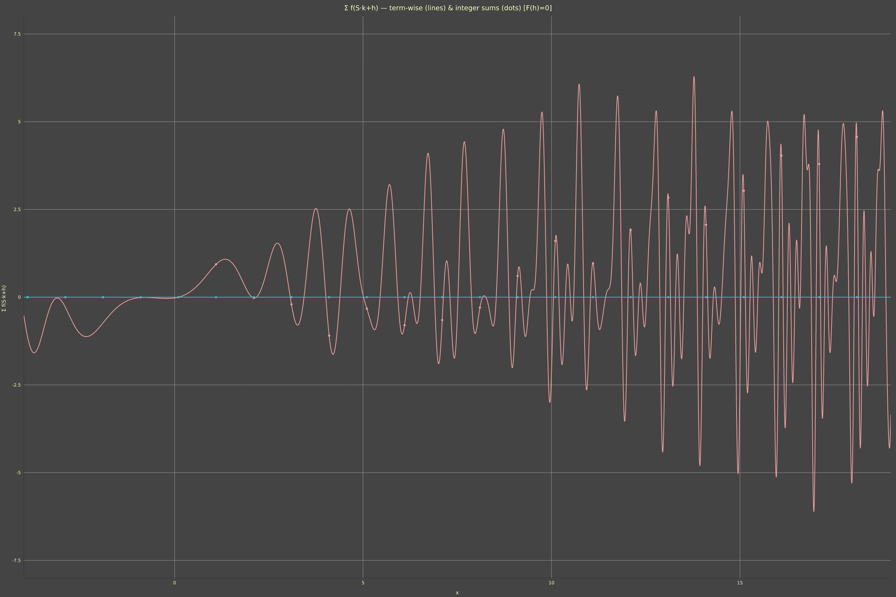

# norlundcalc

Graph (in the future, will perhaps also add maturin bindings for Python calculations) the principal solution to  
$F(z)-F(z-1)=f(z)$, $F(h)=0$ numerically. Binary is currently called `norlundcalc`. Will likely support indefinite products in the future. Lacks series expansion currently.

## Notation

The indefinite sum (antidifference) operator is written as

$${}^{[\text{strip}]}\nabla_{S,h}^{-1} f(x)\delta x \qquad\text{or}\qquad {}^{[\text{strip}]}\Delta_{S,h}^{-1} f(x)\delta x ,$$

where

* $\nabla$ / $\Delta$ – backward / forward difference operator,
* right superscript, e.g., $(-1)$ represents the antidifference (inverse of the first difference) and more generally the order,
* subscript $S$ – step size (positive real, default $1$),
* subscript $h$ – base point where the solution vanishes, i.e. $F(h)=0$ (the empty sum for $h$),
* left superscript $[\text{strip}]$ – the maximal open vertical strip/disjoint connective component of the complex plane
  in which the Nørlund principal solution is pole-free; it is given either explicitly as an interval
  $(a,b)$, $[a,b]$, $(a,\infty)$, ... or as the shorthand $[h]$ meaning “the component containing region $[h,h+S]$”, no brackets on $h$ being interpreted as "the component containing the point $h$". Can also use notation like $\alpha \le \Re(z) < \beta$, $\alpha < \Re(z) < \beta$, etc.
* $\delta x$ – the summation variable (the analytic calculus of finite differences analogue of $dx$, explicitly denoting the variable which is treated as continuous/the shift operator acts upon).

When the step size and base point are clear from context, the subscript may be shortened to $S$ alone,
and the left superscript can be omitted if the function is entire or the strip is unambiguous.

**Examples**

* Entire function (no singularities): $\nabla_{1,0}^{-1} x\delta x = \frac{x(x+1)}{2}$.
* With a pole-free strip: ${}^{(0,\infty)}\nabla_{1,0}^{-1} \frac{1}{x^2+1}\delta x = \mathrm{Im}\psi(1+i)-\mathrm{Im}\psi(x+1+i)$.

---

See <https://www.desmos.com/calculator/anih6sjvmb?backgroundColor=bbb&textColor=235656&invertedColors> for a less robust web version.

## Example: Series Expansion for $\mathrm{arctanh}\sqrt{x}$

Not every function can be done via Abel–Plana. Series expansion fallback (not yet added) can handle even the principal solutions for which we don’t have a nice step length strip for Abel–Plana. As an example, consider  
$f(x) = \mathrm{arctanh}\sqrt{x}$ on $(0,1)$.

The domain of analyticity of $f$ is the vertical strip $0<\Re(z)<1$ (the power series converges there).  
We denote the corresponding principal solution by

$${}^{(0,1)}\nabla_{1,0}^{-1} \mathrm{arctanh}\sqrt{x}\delta x = \sum_{k=1}^{x} \mathrm{arctanh}\sqrt{k}.$$

Expand $\mathrm{arctanh} w$ as a power series:

$$\mathrm{arctanh} w = \sum_{n=0}^{\infty} \frac{w^{2n+1}}{2n+1},
\quad |w| < 1.$$

Substitute $w = \sqrt{x}$ to obtain

$$\mathrm{arctanh} \sqrt{x} = \sum_{n=0}^{\infty} \frac{x^{n+1/2}}{2n+1}.$$

The indefinite sum of a monomial $x^a$ ($a \neq -1$) is given by

$${}^{(0,\infty)}\nabla_{1,0}^{-1} x^a \delta x = \zeta(-a) - \zeta(-a, x+1),$$

where $\zeta(s, q)$ is the Hurwitz zeta function and $\zeta(s) = \zeta(s, 1)$.  
For the strip $(0,1)$ we must restrict to $0<\Re(x)<1$; applying the operator termwise (justified by uniform convergence on compact sets) gives

$${}^{(0,1)}\nabla_{1,0}^{-1} \mathrm{arctanh}\sqrt{x} \delta x
= \sum_{n=0}^{\infty} \frac{1}{2n+1}
   \Bigl[ \zeta\bigl(-n-\tfrac12\bigr) - \zeta\bigl(-n-\tfrac12, x+1\bigr) \Bigr].$$

Truncating the series after enough terms provides a high precision seed (ideally up to machine precision) on an interval inside the radius of convergence, from which we recur outwards like the current Abel–Plana methods.

**Term by term summation**: The series $f(z) = \sum_m c_m (z-p)^m$ is summed as

$$F(z) = \sum_{m} c_m \Bigl[\zeta(-m) - \zeta(-m, z-p+1)\Bigr] + C(x),$$

where the Hurwitz zeta function handles arbitrary complex exponents. This also needs to be shifted to the same $h$ as for each Abel–Plana strip on other linear components.

See also <https://en.wikipedia.org/wiki/User:Sure_Beae/Math_notes>

## Series Expansion for $\mathrm{arctanh}\sqrt{x}$ on $(1,\infty)$

For $\Re(z)>1$ the power series used on $(0,1)$ diverges; instead we expand via
$\mathrm{arctanh}\sqrt{z} = -\frac{i\pi}{2} + \mathrm{arccoth}\sqrt{z}$, which yields the
convergent Laurent series

$$\mathrm{arctanh}\sqrt{z} = -\frac{i\pi}{2} + \sum_{n=0}^\infty \frac{1}{2n+1} z^{-n-\frac12},\qquad \Re(z)>1 .$$

Applying the inverse backward difference $\nabla^{-1}$ termwise (base point $h=1$, step $S=1$):
the constant $-\frac{i\pi}{2}$ sums to $-\frac{i\pi}{2}(z-1)$; a monomial $z^{-a}$ ($a>0,a\neq1$)
with the empty sum condition $F(1)=0$ gives $\zeta(a,2)-\zeta(a,z+1)$. Hence the Nørlund principal
solution on $(1,\infty)$ is

$${}^{(1,\infty)}\nabla_{1,1}^{-1} \mathrm{arctanh}\sqrt{z} \delta z = -\frac{i\pi}{2}(z-1) + \sum_{n=0}^{\infty} \frac{1}{2n+1} \Bigl[ \zeta\bigl(n+\tfrac12, 2\bigr) - \zeta\bigl(n+\tfrac12, z+1\bigr) \Bigr].$$

Truncating after a finite number of terms provides a highly accurate seed on a compact interval which can be extended by recurrance just like all other methods.

For the series expansions, <https://github.com/ChristopherRabotin/hyperdual> or similar will probably be added. Highly accurate generalised Bernoulli polynomials or Hurwitz zeta will need to be added, too.

## Examples

Indefinite sum of sin(z*z) (default)

